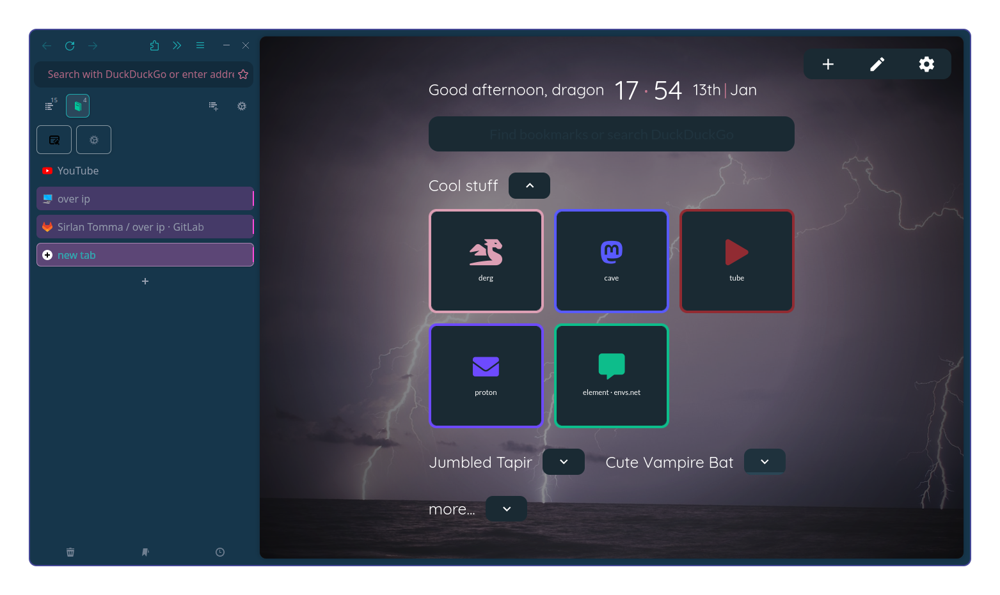

# arcticfox theme
a theme for Firefox (and Sidebery, because it fancy) to make it look and somewhat behave like Arc browser on mac  
  
[a post with a video of it (lsightly earlier in dev) in use](https://derg.social/notes/9ofri85060)  
[little demonstration video with slightly newer version](https://youtu.be/0c-OLC-7gPE)  

🎊 **features**  
* it kinda looks like Arc... that's the whole point
* kinda minimalistic
* has space to grab the window! (quite uncomon with themes that mess with the header bar)
* somewhat tested
* some strightforward(-ish) customization points in the file

---

ℹ️ **addons to use**

- [sidebery](https://github.com/mbnuqw/sidebery) for sidebar tabs, workspaces, groups...
- [Firefox Multi-Account Containers](https://addons.mozilla.org/en-GB/firefox/addon/multi-account-containers) for multiple logins
- [Userchrome Toggle](https://addons.mozilla.org/en-GB/firefox/addon/userchrome-toggle) for toggling keeping the sidebar open (migh try creating an extensions for extra controls later, idk)
- (preference) themes from [Firefox Color](https://addons.mozilla.org/en-GB/firefox/addon/firefox-color/)
    - another recomendation is [Adaptive Tab Bar Color](https://addons.mozilla.org/en-US/firefox/addon/adaptive-tab-bar-colour)

# how to install

yes, it is a bit contrived, but requires quite a specific setup to work well

* clone or download this repo locally
* install the listed addons
    * allow them to run in private windows
* open sidebery settings, go to 'help' and 'import addon data', then select the json file in `sidebery/sidebery-data.json`
* (if not showing already) open the browser sidebar and select the 'sidebery' sidebar
* in the settings for the 'userchrome toggle' extension, for the 'style toggle 1' put `|| ` in prefix (should also have the ending space) and apply changes (you migh also change the name to 'sidebar' if you want, and disable the 'display notification')
* select a firefox theme other than the 'system/auto' one (alpenglow also looks weird with it)
* disable the bookmarks toolbar
* disable the 'firefox view' button (that one at the top, left of the tabs, that firefox enables by default)
* reorder the browser toolbar widgets, they should be in the order
    * `url-bar  'show sidebars'-button  back  forward  reload  spacer  extensions-button  overflow-menu  hamburger-menu`
    * the url bar **must** be the first item in the toolbar
    * there **must** be the sidebar button (for enabling the sidebar in private windows)
    * do this **before** applying the theme, it messes up the customize page
    * also set the density to 'normal' (it probably already is)

**if you don't have userChrome (and browser dev tool) enabled (if you do, skip to the next part)**

* go to `about:config` in the url bar (and accept the message)
* in the search bar insert `toolkit.legacyUserProfileCustomizations.stylesheets`
* if besides it there is a 'false', double click it, it should turn into 'true'

* right click anywhere in the page and open 'inspect' from the menu, it should open the dev panel
* click the three dots at the top right corner of that panel and in settings
* right at the bottom/right in the 'advanced' enable 'enable browser chrome and add-on debugging toolboxes' and 'enable remote debugging'

* close and re-open firefox

_read next section_

(if you want to activate the browser dev tool to inspect the browser ui and live change the css, press 'ctrl + shift + alt + i', it behaves like the normal dev tool but for the browser)

**if/when you have userChrome (and browser dev tools) enabled**

* write `about:profiles` in the url bar
* on the profile that is listed as 'default profile: yes' click 'open directory' for the root directory, it should open your file manager in that folder
    * on flatpak programs, this might show the wrong addres (`/home/$user/.mozilla/...`), the right address is (`/home/$user/.var/app/$app_id/.mozilla/...`)
    * it also might be something other than `.mozilla` if you're using a fork (librewolf)
* create (if doesn't exist) a sub folder called 'chrome' (exact name, all minuscule)
* put the file `chrome/userChrome.css` in there (the file must be called 'userChrome.css')

(ℹ️ **you might want to edit some settings in the css file**, feel free to open it in your text editor, **if you're on Windows** there are some options in the file you need to uncomment to make it work better, do a 'ctrl + f' for `WINDOWS` in the file)

* close and re-open firefox, it should have the theme applied

# using

- put your mouse on the left edge of the window to open the sidebar containing the tabs, url bar, and browser toolbar
- to keep the side bar open, on the extensions list from the toolbar, click the userchrome togge one, it should now keep the sidebar open (might glitch a bit)
- for workflow stuff, see the sidebery documentation
- to drag the window use the header area when it's expanded (yea, the rest of the top edge of the screen doesn't work)

<b>extra customization information and tips</b>

_nothing here yet_

---

⚠️ **btw**

this theme is:
- buggy in some places
- janky in private windows or windows with the sidebar hidden by default
- only comfirmed to work on firefox 119 on linux, and on Windows 10 (with tweaks)
    - tested on some forks, and ESR or anything based on it (waterfox, floorp) does not work
    - the firefox version must fully support the `:has()` css selector
- best used with sidebery but I guess can be used with Tree Style Tab, didn't test tho
- not guaranteed to be 100% working out of the box, you might need to tweak it some
- probably doesn't work with mac window buttons idk

(for some more info and warnings see the comments in `chrome/userChrome.css`)
